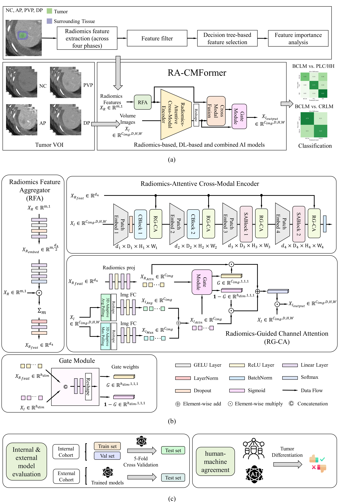

# RA-CMFormer: Radiomics-Attentive Cross-Modal Transformer for Differentiating Breast Cancer Liver Metastases on Contrast-Enhanced CT

## Usage

First, clone the repository locally:
```
$ git clone https://github.com/Hoyant-Su/RA-CMFormer.git
$ cd RA-CMFormer
```
Dependencies are listed as follows:
```
$ conda env create -f environment.yml
```

## Data file directory preparation

Our internal dataset, MCT-LTDiag, has been fully released and is available on the Harvard Dataverse.
Please refer to 👉[Multi-phase_LT_Benchmark](https://github.com/Hoyant-Su/Multi-phase_LT_Benchmark) for the access and preprocessing procedure.


The data are stored in the following structure (Note that the radiomics and label files each contain five folds for cross-validation):   
```
Data
    ├── Image
        ├── type_a_tumor_x.nii.gz
        ├── type_a_tumor_y.nii.gz

        ├── type_b_tumor_x.nii.gz
        ├── type_b_tumor_y.nii.gz

    ├── Label
        ├── exp1
            ├── exp1_fold1
                ├── fold_1_train_label.txt
                ├── fold_1_val_label.txt
                ├── fold_1_test_label.txt

    ├── Radiomics_feat
        ├── exp1
            ├── exp1_fold1
                ├── fold_1_feat.csv

```
Descriptions: 


**Note**: The "Image" folder contains all image samples at the tumor level; the "Label" folder organizes the dataset at the case level and provides ground truth annotations. Based on this organization, corresponding data is extracted from the "Image" and "Radiomics_feat" folders.

## Architecture

Our complete experimental workflow and the proposed RA-CMFormer architecture are illustrated below:




## Implementation
- **Image Part Pretrained Weights**: The `uniformer_base_k400_8x8_partial.pth` checkpoint for the image branch of RA-CMFormer can be obtained from the official project repository or the model's release page. After downloading, place the weights into the `weights` folder.


### Training and Validation

The hyperparameter configurations can be modified in `config/exp_configs.yaml`. After setting the configurations, you can proceed with training and testing. The corresponding scripts are as follows:

```bash
bash do_train_liver_K.sh
```

```bash
bash do_test_liver_K.sh
```

## Citation
```
@data{DVN/S3RW15_2025,
author = {Haoyang Su},
publisher = {Harvard Dataverse},
title = {{MCT-LTDiag}},
year = {2025},
version = {V1},
doi = {10.7910/DVN/S3RW15},
url = {https://doi.org/10.7910/DVN/S3RW15}
}
```
```
@ARTICLE{Wu2025MCTLTDiag,
  title     = "A multi-phase {CT} dataset for automated differential diagnosis
               of liver tumors",
  author    = "Wu, Xiang An and Su, Haoyang and Hua, Yiwei and Xu, Yali and
               Wang, Lilong and Wang, Xiaosong and Wang, Shitian and Jin, Bao
               and Liu, Xiao and Wan, Xueshuai and Sun, Qiang and Wang, Xuan
               and Du, Shunda",
  journal   = "Sci. Data",
  publisher = "Springer Science and Business Media LLC",
  month     =  dec,
  year      =  2025,
  language  = "en"
}
```